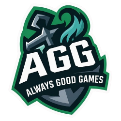

# League Spectator

League Spectator is a OBS overlay tool build for AGG Prime League Games. It curls data from the Riot Game Client API and provides it to a graphical overlay which can be added as browser source in OBS.

## Download
Click the [Releases](https://github.com/AGG-Programming/LeagueSpectator/releases) tab at the top to download the latest version.

Run the executable and create a new browser source in OBS. Set the URL to `http://localhost:8080/` and you're good to go!
The backend now auto-starts the bundled display analyzer (`displayAnalyzer.exe` or `displayAnalyzer/main.py`) so only one executable has to be started.
If you now load into a game the overlay will update automatically.

## Disclaimer
League Spectator is build for personal use and may break at any time.

League Spectator is not endorsed by Riot Games and does not reflect the views or opinions of Riot Games or anyone officially involved in producing or managing Riot Games properties. Riot Games and all associated properties are trademarks or registered trademarks of Riot Games, Inc

## Prime League
League Spectator uses the Prime League API but may work only for AGG Games and needs an API key.

## Deployment
Commands to release a new version:

```
git tag v0.0.1
git push origin v0.0.1
```

Build locally:
```
goreleaser release --snapshot --clean
```
